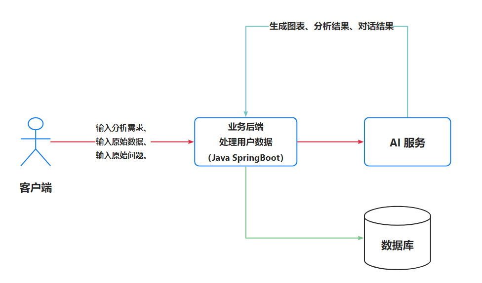
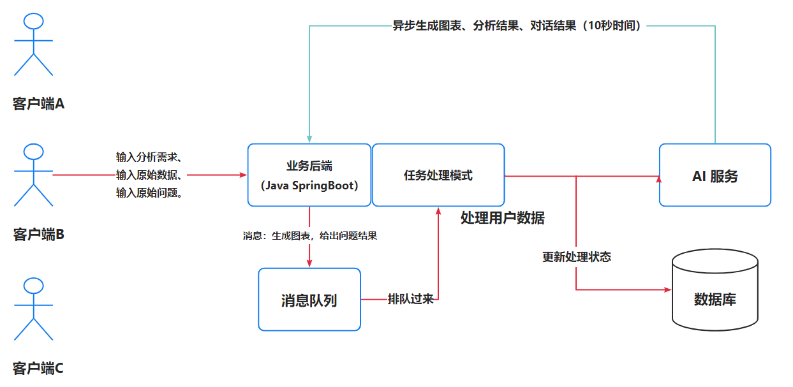
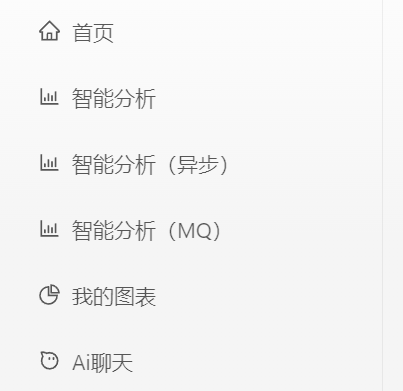
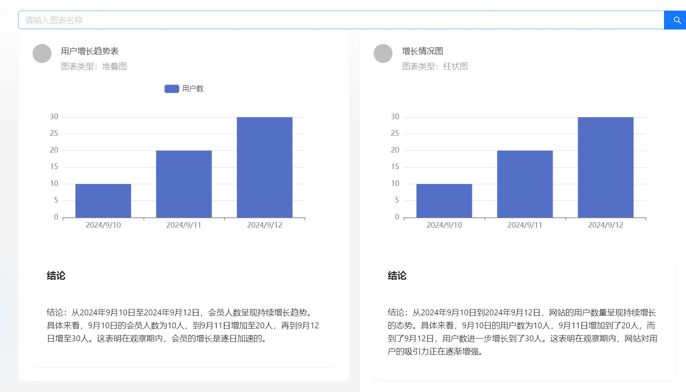
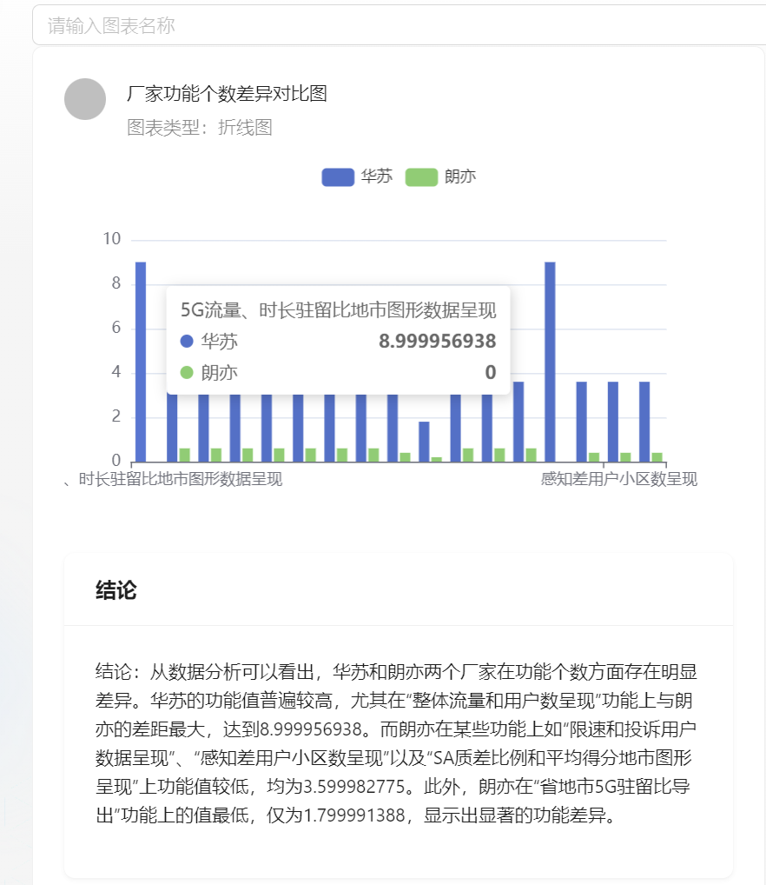
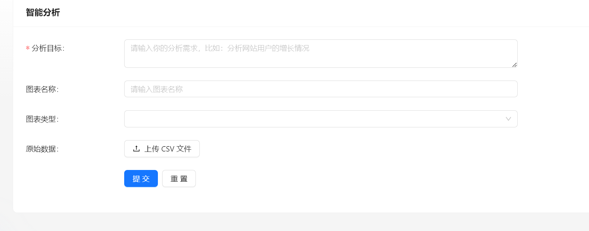
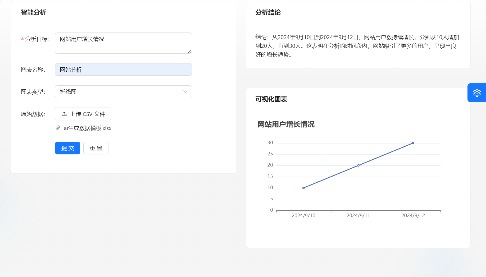
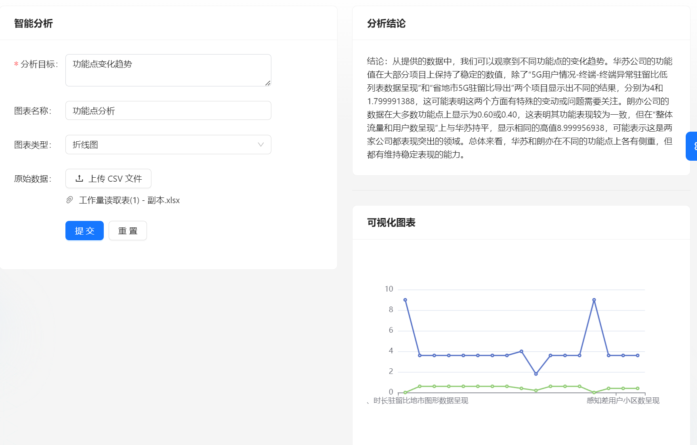

# 智能BI平台

> 基于 Spring Boot + Redis + RabbitMQ + MyBatis Plus + AIGC 的智能数据分析平台。区别于传统的BI，数据分析者只需要导入最原始的数据集，输入想要进行分析的目标，就能利用AI自动生成一个符合要求的图表以及分析结论。此外，还会有图表管理、异步生成等功能。还有文字识别，图片理解功能，帮助用户更好的进行分析决策。只需输入分析目标、原始数据和原始问题，利用 AI 就能一键生成可视化图表、分析结论，大幅降低人工数据分析成本。
> 优势： 让不会数据分析的用户也可以通过输入目标快速完成数据分析，大幅节约人力成本，将会用到 AI 接口生成分析结果。

## 项目背景 

1. 基于AI快速发展的时代，AI + 程序员 = 无限可能。
2. 传统数据分析流程繁琐：传统的数据分析过程需要经历繁琐的数据处理和可视化操作，耗时且复杂。
3. 技术要求高：传统数据分析需要数据分析者具备一定的技术和专业知识，限制了非专业人士的参与。
4. 人工成本高：传统数据分析需要大量的人力投入，成本昂贵。
5. AI自动生成图表和分析结论：该项目利用AI技术，只需导入原始数据和输入分析目标，即可自动生成符合要求的图表和分析结论。
6. 提高效率降低成本：通过项目的应用，能够大幅降低人工数据分析成本，提高数据分析的效率和准确性。

## 系统架构

### 基础架构

**基础架构**：客户端输入分析诉求和原始数据，向业务后端发送请求。业务后端利用AI服务处理客户端数据，保持到数据库，并生成图表。处理后的数据由业务后端发送给AI服务，AI服务生成结果并返回给后端，最终将结果返回给客户端展示。

### 优化项目架构-异步化处理

**优化流程（异步化）**：客户端输入分析诉求和原始数据，向业务后端发送请求。业务后端将请求事件放入消息队列，并为客户端生成取餐号，让要生成图表的客户端去排队，消息队列根据I服务负载情况，定期检查进度，如果AI服务还能处理更多的图表生成请求，就向任务处理模块发送消息。

任务处理模块调用AI服务处理客户端数据，AI 服务异步生成结果返回给后端并保存到数据库，当后端的AI工服务生成完毕后，可以通过向前端发送通知的方式，或者通过业务后端监控数据库中图表生成服务的状态，来确定生成结果是否可用。若生成结果可用，前端即可获取并处理相应的数据，最终将结果返回给客户端展示。在此期间，用户可以去做自己的事情。

## 项目技术栈 

### 前端

- 开发框架：React、Umi
- 脚手架：Ant Design Pro
- 组件库：Ant Designts
- 前后端联调：OpenAPI 插件
- 语法扩展：TypeScript、Less
- 打包工具：Webpack
- 代码规范：ESLint、StyleLint、Prettier
- 图表：ECharts

### 后端

- 主语言：Java
- 框架：SpringBoot 2.7.2、Mybatis-plus
- 数据库：Mysql5.7、Redis
- 限流控制：Redissson
- 消息队列：RabbitMQ
- AI调用：AI SDK(讯飞大模型---4.0Ultra)
- 异步化：JDK 线程池
- 表格数据处理：Easy Excel
- 前后端联调：Swagger，Knife4j
- 发送请求：Hutool

## 项目功能

### 已有功能

1. 用户登录, 注册，个人信息的修改

2. 智能分析（同步）。调用AI根据用户上传csv文件生成对应的 JSON 数据，并使用 ECharts图表 将分析结果可视化展示

3. 智能分析（异步）。使用了线程池异步生成图表，最后将线程池改造成使用 RabbitMQ消息队列 保证消息的可靠性，实现消息重试机制

4. 用户限流。本项目使用到令牌桶限流算法，使用Redisson实现简单且高效分布式限流，限制用户每秒只能调用一次数据分析接口，防止用户恶意占用系统资源

5. 调用AI进行数据分析，并控制AI的输出

6. 由于AIGC的输入 Token 限制，使用 Easy Excel 解析用户上传的 XLSX 表格数据文件并压缩为CSV，实测提高了20%的单次输入数据量、并节约了成本。

7. 后端自定义 Prompt 预设模板并封装用户输入的数据和分析诉求，通过对接 AIGC 接口生成可视化图表 JSON 配置和分析结论，返回给前端渲染。

8. 文字识别功能：将图片中印刷或手写的文字转化为计算机可编码的文字，目前支持中文、英文

9. 图片理解功能：用户输入一张图片和问题，从而识别出图片中的对象、场景等信息回答用户的问题

   

## 项目展示

### BI异步生成（采用消息队列MQ和线程池的方式）

### BI同步生成

### 文字识别

> 将图片中印刷或手写的文字转化为计算机可编码的文字，目前支持中文、英文

### 图片理解

> 用户输入一张图片和问题，从而识别出图片中的对象、场景等信息回答用户的问题

、

## 快速启动

> 所有需要修改的标记了 `todo`，便于大家找到修改的位置

1. 下载/拉取本项目到本地
2. 通过 IDEA 代码编辑器进行打开项目，等待依赖的下载
3. 修改配置文件 `application.yaml` 的信息，比如数据库、Redis、RabbitMQ等
4. 本项目使用的是讯飞星火的api, 因此还需要去对应的平台申请相关的appid等
5. 修改信息完成后，通过 `MainApplication` 程序进行运行项目
